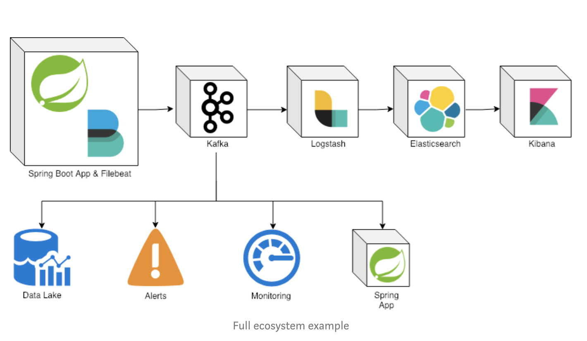
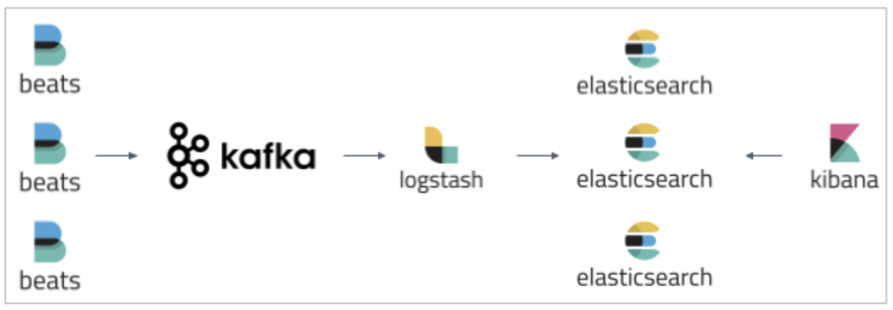
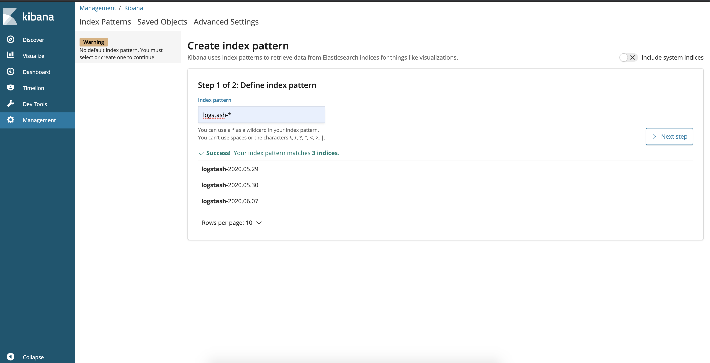
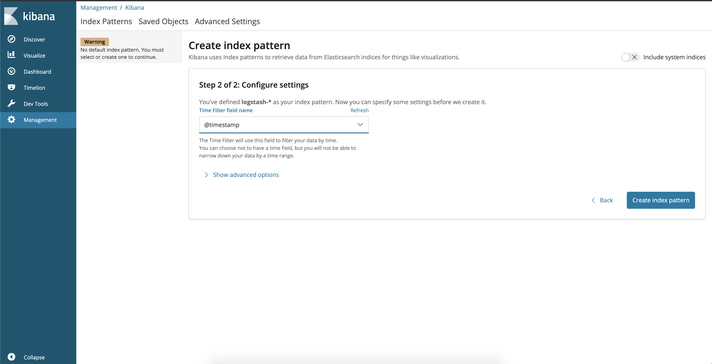
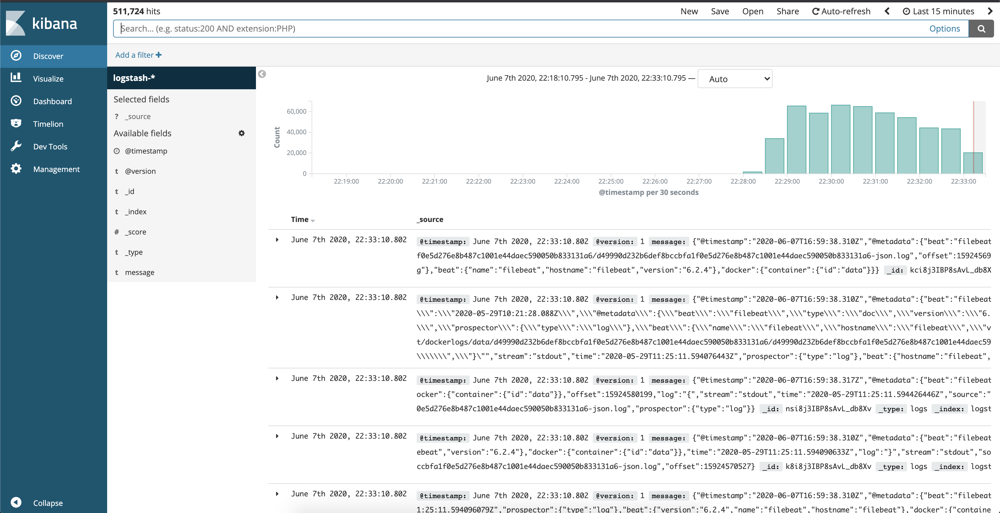

= ELKK Stack

The goal of this project is to implement centralized logging mechanism for spring boot applications.

== Technologies used

* Elastic Search
* Logstash
* Kibana
* Kafka
* Filebeat
* Spring Boot

== Project Architecture

== Applications

* *application*
+
`Spring Boot` Web Java application that generates logs and pushes logs events to `log_stream` topic in `Kafka` using `Filebeat`.

== Start Environment

* Open a terminal and inside `elkk` root folder run
+
[source]
----
docker-compose up -d
----

* Wait a until all containers are Up (healthy). You can check their status by running
+
[source]
----
docker-compose ps
----

== Running Applications with Gradle

Inside `elkk` root folder, run the following `Gradle` commands in different terminals

* *application*
+
[source]
----
./gradlew :application:bootRun
----

== Running Applications as Docker containers

=== Build Application's Docker Image

* In a terminal, make sure you are in `elkk` root folder

* In order to build the applications docker images, run the following script
+
[source]
----
./build-apps.sh
----

=== Application's Environment Variables

* *application*
+
|===
|Environment Variable | Description

|`ZIPKIN_HOST`
|Specify host of the `Zipkin` distributed tracing system to use (default `localhost`)

|`ZIPKIN_PORT`
|Specify port of the `Zipkin` distributed tracing system to use (default `9411`)

|===

=== Start Application's Docker Container

* In a terminal, make sure you are inside `elkk` root folder

* Run following script
+
[source]
----
./start-apps.sh
----

== Configuring Kibana

* You can then access kibana in your web browser: http://localhost:5601.

* The first thing you have to do is to configure the ElasticSearch indices that can be displayed in Kibana.

* You can use the pattern logstash-* to include all the logs coming from FileBeat via Kafka.

* You also need to define the field used as the log timestamp. You should use @timestamp as shown below:

* And you are done. You can now visualize the logs generated by FileBeat, ElasticSearch, Kibana and your other containers in the Kibana interface:

== Applications URLs

|===
|Application |URL

|application
|http://localhost:9082/

|kibana dashboard
|http://localhost:5601

|===

== Shutdown

* Stop applications
** If they were started with `Gradle`, go to the terminals where they are running and press `Ctrl+C`
** If they were started as a Docker container, run the script below
+
[source]
----
./stop-apps.sh
----

* Stop and remove docker-compose containers, networks and volumes
+
[source]
----
docker-compose down -v
----

== Useful links

* *Kafka Topics UI*
+
`Kafka Topics UI` can be accessed at http://localhost:8085

* *Zipkin*
+
`Zipkin` can be accessed at http://localhost:9411
+
The figure below shows an example of the complete flow a news passes through. It goes since `producer-api`, where the news is created, until `news-client`.
+

* *Kafka Manager*
+
`Kafka Manager` can be accessed at http://localhost:9000
+
The figure below shows the Kafka topics consumers. As we can see, the consumers are updated as the `lag` is `0`
+
image::images/kafka-manager-consumers.png[]
+
*Configuration*
+
- First, you must create a new cluster. Click on `Cluster` (dropdown button on the header) and then on `Add Cluster`
- Type the name of your cluster in `Cluster Name` field, for example: `MyZooCluster`
- Type `zookeeper:2181` in `Cluster Zookeeper Hosts` field
- Enable checkbox `Poll consumer information (Not recommended for large # of consumers if ZK is used for offsets tracking on older Kafka versions)`
- Click on `Save` button at the bottom of the page.

* *Elasticsearch REST API*
+
Check ES is up and running
+
[source]
----
curl http://localhost:9200
----
+
Check indexes in ES
+
[source]
----
curl http://localhost:9200/_cat/indices?v
----
+
Check _news_ index mapping
+
[source]
----
curl http://localhost:9200/news/_mapping
----
+
Simple search
+
[source]
----
curl http://localhost:9200/news/news/_search
----